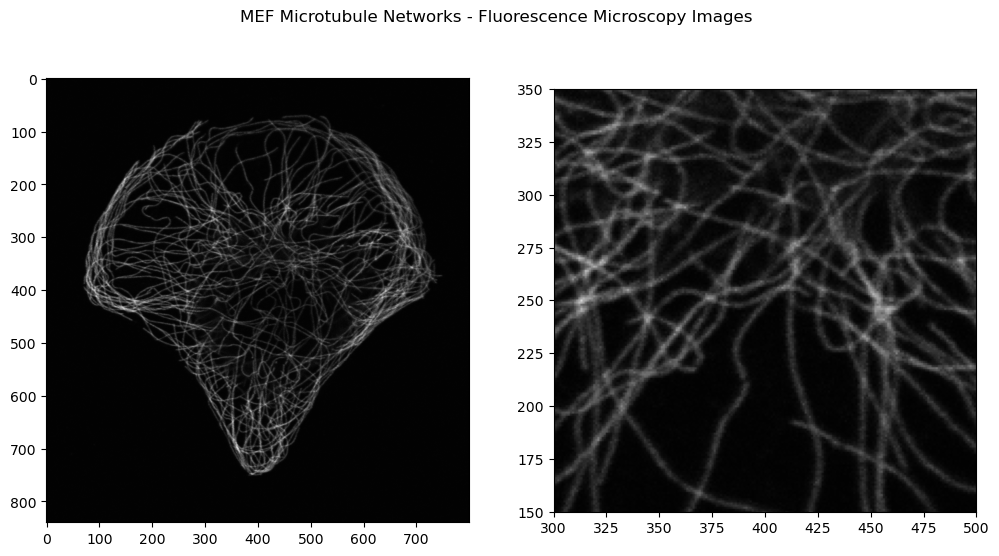
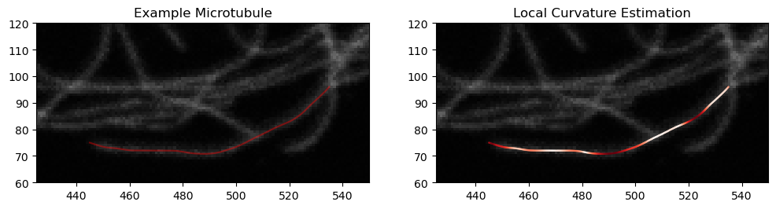

# Fluorescence Microscopy - Filament Extraction
A python package to extract filament like structures from fluorescence microscopy images using a CNN approach.

_Author: David Ventzke_

### Introduction
When analysing confocal fluorescence microscope images of cytoskeletons or other biological protein networks one may be confronted with the task to extract all the filaments from such a noisy image for further analysis of the network. This should include approximating curves for each of the detected filaments.

CyCNN solves this problem and idenfies all filament like structures in an image as well as close approximation of the filament shapes (as much as the image resolution permits). While this method was developed to analyze in-vivo networks of microtubules but generalizes well to other types of filament networks. A demo can be found in the following [Jupyter-Notebook](CNN%20Demo.ipynb)

Our algorithm makes use of a Convolutional Neural Network trained on filament network structures to invert the artefacts introduced by the flourescence microscopy imaging process (i.e. different types of imaging noise, Point-Spread-Functions, etc.). The network reliably identifies filaments and also allows for differentiation of close by or intersecting filaments. In a second step identfied filaments are smoothly interpolated on the pixel grid, based on the intensity distribution of the image. For further details see [Methods](#methods)

### Example

Consider the following cell image of Microtubules in a MEF (image on the right is a subsection). We would like to detect all the Microtubules in the dense network and retrieve their coordinates from the image. 

Applying the method from this repository yields the following result on the given image: The filaments detected are highlighted in red.

The package also provides automatic local orientation and curvature estimates of with the coordinates of each extracted filament. 

### Methods

Suppose we have an approximately planar network of protein filaments. Then we can describe each filament by some curve in the plane $f_i: [0,1] \mapsto \mathbb{R^2}$. These filaments $f_1,..,f_n$ are then imaged and we obtain an image like in the example above. During the imaging process the filament intensities are convolved with a point-spread function and the final intensity at a pixel is furthermore subject to different noise effects (possion noise, detector noise,..). We can thus write the imaging process as some operator $\mathcal F$ where $$\mathcal{F}:{f_i}_{i=1,..,n} \mapsto I$$ where $I$ is the resulting image of pixel-wise intensities. We would now like to learn an inverse to this map $\mathcal F$ given the knowledge that the initial configuration that was images was some element in a manifold of possible filament configurations.

We now *TODO*